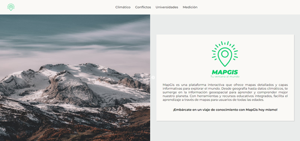
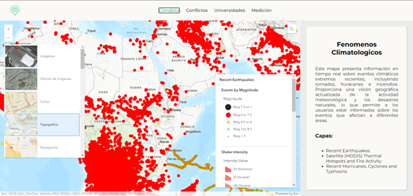

# MapGis


## Tecnologías usadas

- **angular**: 17.2.0
- **arcgis/map-components-angular**: 4.29.10
- **arcgis/charts-components-angular**: 4.29.10

## Run Local

Instale dependencias en la carpeta raiz carpetas

```bash
  npm install
```

Para levantar el servidor ejecute el siguiente comando.

```bash
  npm start
```

Ingresar en el navegador a

- <http://localhost:4200/>

## Preview

- **Landing**



- **Vista Mapas**


